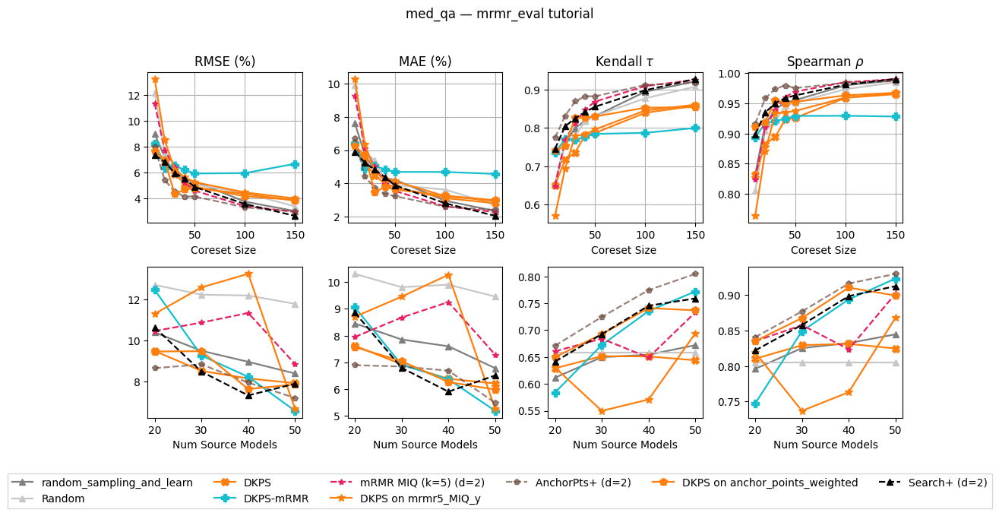

# med_qa: DKPS-guided active mRMR (`dkps_mrmr`) vs. baselines

Benchmark-prediction comparison on the HELM **med_qa** task. `dkps_mrmr` is the
new iterative, per-target coreset method (DKPS-embed → pick the `k` nearest
source models → mRMR step, repeated), evaluated against `dkps`, the kernel-ridge
mRMR baseline, the DKPS backfill variants, and random sampling.

Split: `binned_interpolation`, 3 seeds. Metric tables below are MAE (%) — lower
is better.

*Top row: RMSE / MAE / Kendall τ / Spearman ρ vs. coreset size (source models =
40). Bottom row: same metrics vs. number of source models (coreset = 1%).
`DKPS-mRMR` is the teal "✚" line.*

## Numbers

Method key ↔ figure label: `random_sampling_and_learn` = Random+,
`random_sampling` = Random, `dkps` = DKPS, `dkps_mrmr` = **DKPS-mRMR (new)**,
`kmrmr5_MIQ_y` = mRMR MIQ (KRR), `dkps+mrmr5_MIQ_y` = DKPS on mRMR coreset,
`kanchor_points_weighted+` = AnchorPts+ (KRR), `dkps+anchor_points_weighted` =
DKPS on AnchorPts coreset, `krandom_search_and_learn` = **Search+** (KRR).
Per-column best is **bold**.

**Top row — source models = 40, MAE (%) by coreset size (lower is better):**

| method | 1% | 2% | 3% | 4% | 5% | 10% | 15% |
|---|---:|---:|---:|---:|---:|---:|---:|
| random_sampling_and_learn | 7.60 | 5.74 | 4.77 | 4.31 | 4.22 | 2.97 | 2.35 |
| random_sampling | 9.90 | 5.85 | 5.38 | 4.22 | 3.90 | 3.63 | 2.72 |
| dkps | 6.39 | 5.27 | 4.47 | 4.00 | 3.77 | 3.12 | 2.82 |
| **dkps_mrmr** | 6.37 | 4.91 | 5.04 | 4.85 | 4.69 | 4.69 | 4.57 |
| kmrmr5_MIQ_y | 9.25 | 6.11 | 5.00 | 3.96 | 3.55 | 2.63 | 2.28 |
| dkps+mrmr5_MIQ_y | 10.27 | 6.35 | 4.72 | 4.23 | 4.14 | 3.24 | 2.95 |
| kanchor_points_weighted+ | 6.69 | **4.41** | 3.72 | **3.37** | **3.24** | **2.61** | 2.41 |
| dkps+anchor_points_weighted | 6.27 | 5.68 | **3.48** | 3.80 | 3.64 | 3.27 | 2.99 |
| krandom_search_and_learn (Search+) | **5.91** | 5.25 | 4.82 | 4.38 | 3.89 | 2.81 | **2.06** |

**Top row — Spearman ρ by coreset size (higher is better):**

| method | 1% | 2% | 3% | 4% | 5% | 10% | 15% |
|---|---:|---:|---:|---:|---:|---:|---:|
| random_sampling_and_learn | 0.832 | 0.915 | 0.940 | 0.951 | 0.955 | 0.980 | 0.988 |
| random_sampling | 0.804 | 0.904 | 0.921 | 0.946 | 0.951 | 0.973 | 0.985 |
| dkps | 0.831 | 0.882 | 0.894 | 0.923 | 0.926 | 0.959 | 0.965 |
| **dkps_mrmr** | 0.894 | 0.917 | 0.921 | 0.924 | 0.929 | 0.929 | 0.928 |
| kmrmr5_MIQ_y | 0.824 | 0.910 | 0.938 | 0.961 | 0.969 | **0.985** | **0.990** |
| dkps+mrmr5_MIQ_y | 0.763 | 0.870 | 0.933 | 0.935 | 0.937 | 0.960 | 0.967 |
| kanchor_points_weighted+ | **0.916** | **0.958** | **0.974** | **0.979** | **0.975** | 0.984 | 0.987 |
| dkps+anchor_points_weighted | 0.910 | 0.919 | 0.955 | 0.950 | 0.952 | 0.963 | 0.967 |
| krandom_search_and_learn (Search+) | 0.898 | 0.935 | 0.950 | 0.959 | 0.963 | 0.981 | **0.990** |

**Bottom row — coreset = 1%, MAE (%) by number of source models:**

| method | 20 | 30 | 40 | 50 |
|---|---:|---:|---:|---:|
| random_sampling_and_learn | 8.46 | 7.86 | 7.60 | 6.78 |
| random_sampling | 10.31 | 9.81 | 9.90 | 9.46 |
| dkps | 7.62 | 6.93 | 6.39 | 6.21 |
| **dkps_mrmr** | 9.06 | 6.91 | 6.37 | **5.19** |
| kmrmr5_MIQ_y | 7.95 | 8.68 | 9.25 | 7.29 |
| dkps+mrmr5_MIQ_y | 8.71 | 9.45 | 10.27 | 5.26 |
| kanchor_points_weighted+ | **6.90** | 6.85 | 6.69 | 5.49 |
| dkps+anchor_points_weighted | 7.57 | 7.05 | 6.27 | 5.99 |
| krandom_search_and_learn (Search+) | 8.86 | **6.80** | **5.91** | 6.51 |

## Read

- **Not a general winner — and it does not beat Search+.** Across the
  40-source-model top row, `dkps_mrmr` is beaten at **every** coreset size by
  `Search+` (`krandom_search_and_learn`) and by the kernel anchor-points method
  (`kanchor_points_weighted+`). It wins no top-row column on either MAE or
  Spearman ρ.
- **Mid-pack at tiny budgets.** At 1% it is respectable — MAE 6.37, ρ 0.894,
  ahead of plain `dkps`, random sampling and `kmrmr5_MIQ_y` — but still behind
  `Search+` (5.91 / 0.898) and both anchor-points variants (ρ ≈ 0.91). So "best
  at small coresets" was overstated; it is upper-middle, not top.
- **Plateaus → worst at large budgets.** MAE flattens around ~4.6% (ρ ≈ 0.93)
  while every other method keeps improving to 2.0–2.9% MAE / ρ ≈ 0.96–0.99 by
  15%, making `dkps_mrmr` the **worst** method at 10–15%.
- **One genuine bright spot: many source models, tiny coreset.** At coreset 1%
  its accuracy improves sharply with the number of source models (9.06 → 5.19
  MAE from 20 → 50), and at **50 source models it is the single best method**
  (5.19, edging `dkps+mrmr5_MIQ_y` 5.26 and `Search+` 6.51). The per-target DKPS
  regression appears to need many anchor models to pay off — the only corner
  where `dkps_mrmr` overtakes `Search+`.

## Caveats

- `dkps_mrmr` is plotted only where the figure displays it (top row at 40 source
  models; bottom row at coreset 1%); the off-plot grid cells were not computed.
- It is markedly more expensive than the other methods: because the coreset is
  rebuilt adaptively for every target model, a single trial ranges from ~3 s at
  coreset 1% to ~2.5 min at 15% (vs. sub-second for `dkps`).
